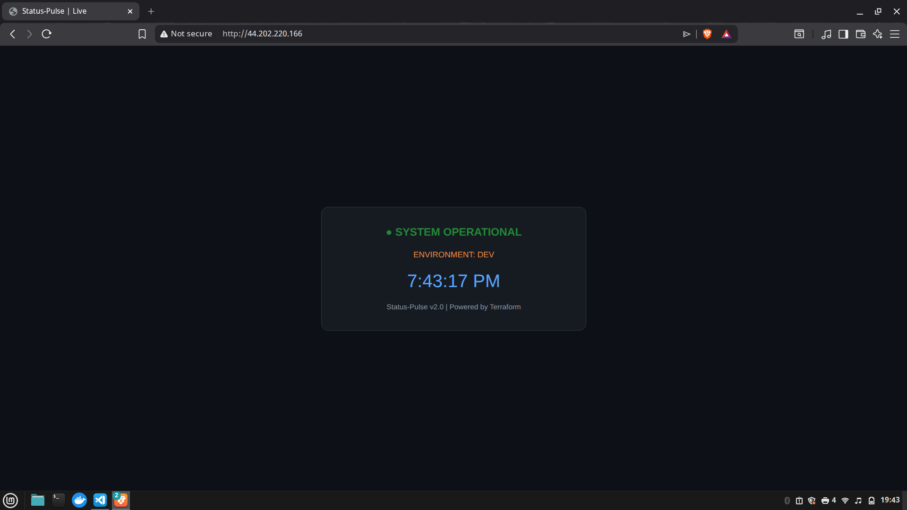

# 🚀 Project Status-Pulse: Automated Cloud Infrastructure


[](https://github.com/IgorAbade14/Status-Pulse/actions/workflows/terraform.yaml)

**Status-Pulse** is an Infrastructure as Code (IaC) project designed to provision a complete, secure, and automated environment on AWS. It deploys a containerized web dashboard with a real-time operational clock, demonstrating the power of automated provisioning.

---

## 📸 Final Result
*(Tip: Replace the link below with your actual screenshot from the repository)*



---

## 🛠️ Tech Stack & Features

- **Infrastructure as Code:** 100% managed by **HashiCorp Terraform**
- **Cloud Provider:** **AWS** (VPC, Subnets, Internet Gateway, Route Tables)
- **Security:** Strict **Security Groups** (Firewall) rules for SSH and HTTP access
- **Containerization:** Automated **Docker Engine** installation and **Nginx** deployment
- **Dynamic Scaling:** Environment-based instance selection (Dev vs Production)
- **Bootstrap Automation:** Custom `user_data` script to inject HTML/JS into the live container

---

## 🏗️ Project Architecture

The project is organized into clean, reusable modules:

- **`modules/network`** → VPC and connectivity foundation  
- **`modules/security`** → Firewall and access control  
- **`modules/app`** → EC2 compute, S3 storage, and Docker provisioning  

---

## 🚀 How to Run

### 1. Prerequisites

- [Terraform](https://www.terraform.io/downloads.html) installed  
- [AWS CLI](https://aws.amazon.com/cli/) configured with your credentials  
- An AWS Key Pair named `chave-projeto-abade`  

### 2. Initialization

```bash
terraform init
```

### 3. Plan & Apply

```bash
# Preview the infrastructure
terraform plan

# Deploy to AWS
terraform apply -auto-approve
```

### 4. Access the Dashboard

Once finished, Terraform will output the `instance_ip`. Open it in your browser:

```
http://<INSTANCE_IP>
```

---

## 📈 Roadmap (Next Steps)

- [ ] Migrate state to S3 Remote Backend  
- [ ] Implement CI/CD pipeline with GitHub Actions  
- [ ] Add HTTPS/SSL via Let's Encrypt  
- [ ] Enable CloudWatch monitoring alerts  

---

## 👨‍💻 Author

https://github.com/IgorAbade14  
https://www.linkedin.com/in/igorabade14/


